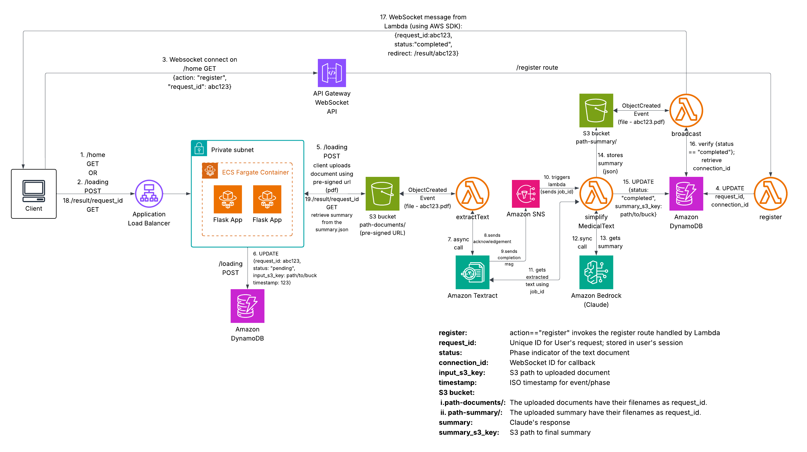

# 🩺 Medical Report Simplifier using AWS Serverless Services

## 🧠 Overview

This project is a serverless web application that simplifies complex medical reports into easy-to-understand summaries using **Amazon Textract**, **Amazon Bedrock (Claude)**, and **AWS Lambda**. Built for the AWS Lambda Hackathon, the application enables users to upload PDF reports and receive human-friendly summaries in real-time using a WebSocket-based callback mechanism.

---

## 🚀 Features

- Upload a multi-page medical report in PDF format
- Automatically extract text using **Amazon Textract**
- Summarize the extracted text using **Claude (via Amazon Bedrock)**
- Asynchronous flow with WebSocket-based updates to client
- Final summary is stored and retrieved via S3
- Fully serverless and scalable architecture with ECS Fargate for Flask frontend

---

## 🧰 AWS Services Used

| Service                     | Purpose                                                                 | Required IAM Permissions                                                                                         |
|-----------------------------|-------------------------------------------------------------------------|------------------------------------------------------------------------------------------------------------------|
| **Amazon Textract**         | Extracts raw text from uploaded PDF documents                          | `textract:StartDocumentTextDetection`, `textract:GetDocumentTextDetection`                                      |
| **Amazon Bedrock (Claude)** | Simplifies extracted text into patient-friendly language                | `bedrock:InvokeModel`                                                                                            |
| **Amazon S3**               | Stores uploaded PDFs and generated summaries                            | `s3:PutObject`, `s3:GetObject`, `s3:DeleteObject`, `s3:ListBucket`                                               |
| **AWS Lambda**              | Orchestrates document processing pipeline, text extraction, summarization, and WebSocket updates | `dynamodb:*Item`, `s3:*Object`, `textract:*`, `bedrock:InvokeModel`, `sns:Publish`, `execute-api:ManageConnections` |
| **Amazon DynamoDB**         | Tracks processing status and metadata per request                       | `dynamodb:PutItem`, `dynamodb:UpdateItem`, `dynamodb:GetItem`, `dynamodb:Query`                                 |
| **Amazon SNS**              | Triggers downstream summarization after text extraction                 | `sns:Publish`, `sns:Subscribe`                                                                                   |
| **API Gateway (WebSocket)** | Enables real-time status updates back to the client                     | `execute-api:ManageConnections`                                                                                  |
| **ECS Fargate**             | Hosts the Flask application frontend in a private subnet                | (If accessing AWS services) `s3:GetObject`, `dynamodb:GetItem`, `dynamodb:PutItem`                               |
| **Application Load Balancer** | Routes user requests to the Fargate container                        | Not applicable                                                                                                   |


---

## 🧭 Architecture Diagram



---

## 🧬 Architecture Flow


The system follows this high-level sequence (refer to diagram):

1. Client sends a `/upload` POST request via the Flask frontend (hosted on ECS Fargate).
2. Flask app returns a pre-signed S3 upload URL.
3. Client uploads the PDF using that URL.
4. S3 upload triggers a **Lambda** via an `ObjectCreated` event.
5. Lambda updates DynamoDB with `status: pending` and makes an **async call to Textract**.
6. Textract extracts text and notifies via **SNS**.
7. SNS triggers another **Lambda**, which:
    - Fetches the extracted text
    - Calls **Claude (via Bedrock)** to simplify it
    - Uploads the final summary to another S3 bucket
8. Another **Lambda** is triggered by the summary file upload.
9. This Lambda updates the `status` to `completed` in DynamoDB and notifies the client over **WebSocket**.
10. Client polls or refreshes the results page using `/result/<request_id>`.

---

## 📝 AWS Lambda Usage

AWS Lambda is central to the application's orchestration:

1. **Initial Processing Lambda**  
   - Triggered by the S3 upload event   
   - Starts Textract async job  

2. **Textract Completion Lambda**  
   - Triggered by SNS  
   - Retrieves text using `job_id`  
   - Calls Amazon Bedrock (Claude) for summarization  

3. **Summary Storage Lambda**  
   - Triggered by S3 summary upload  
   - Updates status in DynamoDB  
   - Uses WebSocket API to inform the frontend  

Each Lambda is stateless and linked through event-driven mechanisms to achieve end-to-end automation.

---

## 🔧 How to Run the Application

### Prerequisites


### Basic Flow


Upload a PDF → wait for WebSocket notification → view result at `/result/<request_id>`.

---

## 📄 Example

Input PDF: 
Output:  


---

## 💡 Innovation Highlights

- **Lambda-Orchestrated Workflow**: The entire document processing pipeline is broken into discrete, event-triggered Lambda functions—ensuring loosely coupled micro-tasks, fault isolation, scalability, and minimal idle cost. Each Lambda serves a unique purpose (trigger, process, notify), showcasing the best practices of serverless design.
- **Serverless-by-design** with scalability in mind
- Real-time feedback using WebSocket (uncommon in static summary tools)
- Use of **Claude** via Bedrock for natural summarization
- **Asynchronous, event-driven architecture** using SNS and S3 triggers

---

## 📁 Repository Contents

```
📁 /app
   ├── main.py              # Flask backend
   ├── routes.py            # Upload, result handlers
📁 /lambdas
   ├── textract_trigger.py  # First Lambda: starts Textract
   ├── summarizer.py        # Second Lambda: calls Bedrock
   ├── notifier.py          # Third Lambda: sends WebSocket
📁 /infra
   ├── cdk_stack.py         # AWS CDK or CFN templates
📄 README.md
```
